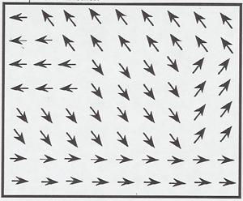
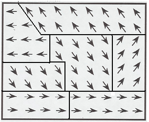

### Theory 

A ferromagnet has a spontaneous magnetic moment. The atoms (or molecules) of ferromagnetic materials have a net intrinsic magnetic dipole moment which is primarily due to the spin of electrons. The interaction, called as spin exchange interaction, between the neighbouring atomic magnetic dipoles is very strong and exists even in the absence of an external magnetic field.
 
Magnetization could be explained based on Domain theory. Weiss postulated the existence of domains within the ferromagnetic material. Within these domains the material is magnetized to saturation but the direction of magnetization differs from domain to domain, resulting in a zero resultant magnetization of the specimen. The process of magnetization consists in rotating the different domains in the direction of applied external field so that the specimen exhibits a net magnetization externally.

<table border=0>
  <tr>
    <td align="center"></td>
    <td align="center"></td>
  </tr>
</table>

The Barkhausen effect is an indirect evidence of the existence of magnetic domains within ferromagnetic materials. When domains grow, under an applied magnetic field, the movement of the domain walls occurs by discontinuous and abrupt Barkhausen jumps. The jumps in magnetization of a ferromagnetic material can induce a voltage in a winding coil of wire that in turn can produce Barkhausen noise.
 
In the Barkhausen effect, a large coil of fine wire is connected through an amplifier to a speaker. When an iron rod is placed within the coil and stroked with a magnet, an audible roaring sound will be produced from the sudden realignments of the magnetic domains within the rod. Due to electromagnetic induction, the shifting of a domain creates a change in the magnetic field around the iron, and that changing magnetic field induces a current in the surrounding coil detectable by the amplifier.
